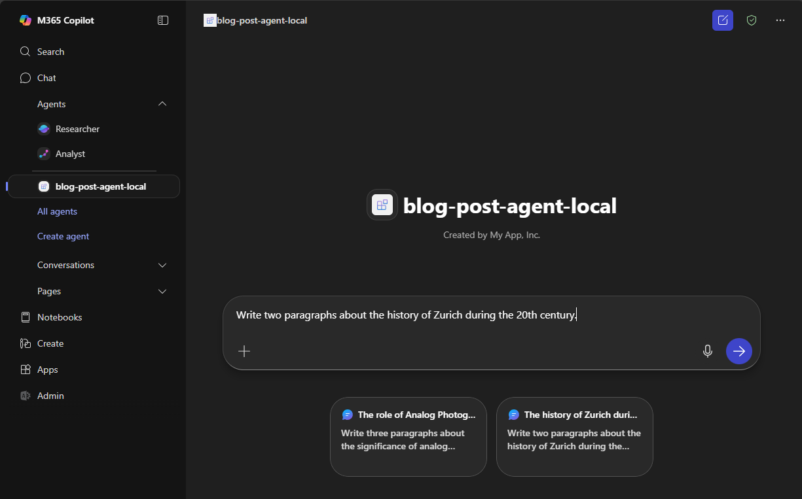

# M365 Custom Engine Agent

TL;DR: If you already have a multi‑agent AI application, you can surface it inside Microsoft 365 Copilot without adding another orchestration layer. Use a thin “proxy agent” built with the [Microsoft 365 Agents SDK](https://github.com/microsoft/Agents) to handle Copilot activities and forward a simple request to your existing backend (in this example, we will use a simple Semantic Kernel multi‑agent workflow that writes and SEO‑optimizes blog posts). Develop fast and deploy to Azure with the Microsoft 365 Agents Toolkit for VS Code.


## Table of Contents
1. [Project Structure](#project-structure)
2. [Prerequisites](#prerequisites)
3. [Reference Architecture](#reference-architecture)
4. [Backend: Semantic Kernel + Azure OpenAI](#the-backend-with-semantic-kernel-agents--azure-openai)
5. [Backend Deployment](#backend-deployment)
    - [Docker Container](#option-1-run-backend-in-a-container)
    - [Standalone App](#option-2-run-backend-as-a-standalone-app)
6. [Copilot Deployment](#copilot-deployment)
7. [Licensing](#licensing)
8. [Contributing](#contributing)

## Project Structure
```
backend/                Python backend service exposing a Semantic Kernel multi-agent workflow through FastAPI
cea-proxy-ts/           TypeScript based proxy agent to receive messages from Copilot and forward them to the backend
cea-proxy-py/           Python based proxy agent to receive messages from Copilot and forward them to the backend
```

## Prerequisites
1. AI Foundry Project 
2. Azure OpenAI deployment (preferably with a model supporting OpenAI Responses API)
3. M365 Copilot License
4. Sideloading is enabled in Microsoft Teams
5. [M365 Agents Toolkit Extension](https://marketplace.visualstudio.com/items?itemName=TeamsDevApp.ms-teams-vscode-extension)

## Reference architecture

**High‑level flow:**

1. Microsoft 365 Copilot Chat → user selects your agent and submits a prompt.
2. Azure Bot Service → delivers Copilot activities (i.e. user messages) securely to your bot endpoint.
3. Proxy Agent (Microsoft 365 Agents SDK) → authenticates, handles activities, and forwards a simple, uniform request to your backend—no extra orchestration here.
4. Your CEA backend → runs your own multi‑agent workflow and returns results for the proxy to relay back to Copilot.

This keeps Copilot integration thin while preserving your orchestration choices.

**Sequence diagram:**


## The Backend with Semantic Kernel Agents + Azure OpenAI

The backend (`backend/main.py`) is a FastAPI app using Semantic Kernel’s Azure Responses Agents with Azure OpenAI. It exposes one uniform endpoint consumed by the proxy:

- `POST /generate-blog`
  - Accepts: `{ topic, length }` or `{ prompt }` (free‑form)
  - Returns: `{ content: string }` (final markdown)

Sequence diagram of the internal multi‑agent workflow:


**Multi‑agent flow:**

1. Parameter Extraction Agent
   - Input: Free‑form prompt
   - Output: JSON with `topic` and `length` (clamped; default 5)
   - Model: Small, low‑temperature for deterministic structure

2. Blog Writer Agent
   - Input: `topic`, `length`
   - Output: Markdown draft
   - Model: Creative settings for richer content

3. SEO Optimizer Agent
   - Input: The draft
   - Output: Structured JSON (title, meta, slug, headings, revised article, improvements, keywords, links, readability, CTA)
   - The structured SEO output is fed back into the writer for a final pass

## Backend Deployment
### Prerequisites
1. Rename `sample.env` to `.env`
2. Fill in the required values:
```
AZURE_OPENAI_ENDPOINT=
AZURE_OPENAI_API_KEY=
AZURE_OPENAI_CHAT_DEPLOYMENT_NAME=
AZURE_OPENAI_RESPONSES_DEPLOYMENT_NAME=
AZURE_OPENAI_API_VERSION=
```

### [Option 1] Run backend in a container
> ⚠️ Requires [Docker Desktop](https://www.docker.com/products/docker-desktop/) or a similar Docker engine.

From repo root:
```bash
cd backend
docker build -t backend-blog-agent:latest .
docker run -d --env-file .env -p 8000:8000 --name backend-blog-agent backend-blog-agent
```

### [Option 2] Run backend as a standalone app
> ⚠️ Make sure you are using the [uv package manager](https://docs.astral.sh/uv/)

From repo root:
```bash
cd backend
uv venv
uv sync
uvicorn main:app --host 127.0.0.1 --port 8000
```

## Copilot Deployment
For demonstration purposes, the proxy agent in this sample is provided in two different flavors: Python and TypeScript. The process to run your Custom Engine Agent is exactly the same.

1. Open `cea-proxy-ts` or `cea-proxy-py` as the root folder in Visual Studio Code
2. Open the M365 Agents Toolkit
3. Sign-in to M365 and Azure

    

4. Select Debug with your `local` Environment. This will:
    - Create a `devtunnel` to emulate an Azure Bot and forward requests to your CEA
    - Register a App registration in Entra ID which is tied to your Bot service
    - Register the newly created Bot in Teams and Copilot
    - Open a browser window to Copilot and launch your Copilot Agent

5. Enter your prompt, provide a blog post topic and indicate its length.

    
    

## Licensing
MIT License (see [LICENSE](./LICENSE.md)).

## Contributing
See [CONTRIBUTING](./CONRTIBUTING.md) for details.