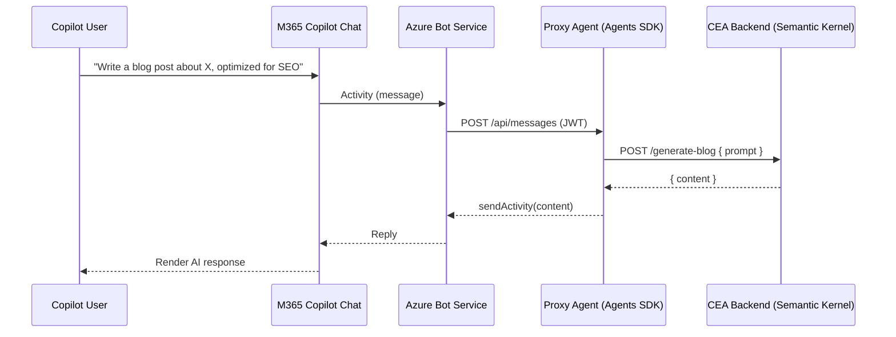
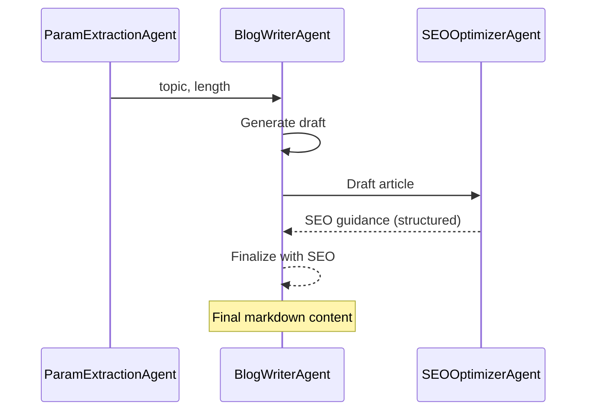
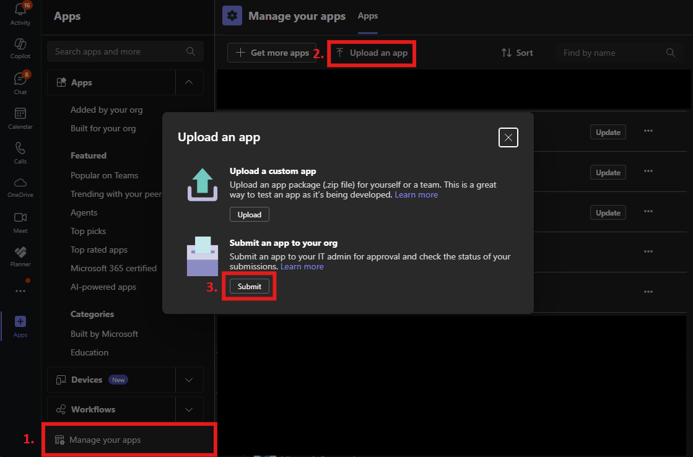

# Build Custom Engine Agents for Microsoft 365 Copilot (Microsoft 365 Agents SDK)

TL;DR: If you already have a multi‑agent AI application, you can surface it inside Microsoft 365 Copilot without adding another orchestration layer. Use a thin “proxy agent” built with the [Microsoft 365 Agents SDK](https://github.com/microsoft/Agents) to handle Copilot activities and forward a simple request to your existing backend (in this example, we will use a simple Semantic Kernel multi‑agent workflow that writes and SEO‑optimizes blog posts). Develop fast and deploy to Azure with the Microsoft 365 Agents Toolkit for VS Code.

> ☝️ If you wish to jump right into the code and a step-by-step deployment guide, visit this [GitHub Repo](https://github.com/Azure-Samples/m365-custom-engine-agents).

## Table of contents

- [What are Custom Engine Agents?](#what-are-ceas)
- [Reference architecture](#reference-architecture)
- [Implementing the proxy agent (TypeScript and Python)](#proxy-agent)
- [Designing the CEA backend with Semantic Kernel + Azure OpenAI](#backend-semantic-kernel)
- [Make it Copilot-ready: manifest essentials](#manifest-essentials)
- [Get started fast with the Microsoft 365 Agents Toolkit (VS Code)](#vscode-toolkit)
- [When to use this pattern](#when-to-use)
- [FAQs](#faqs)
- [References](#references)
- [Repository resources](#repo-resources)


<a id="what-are-ceas"></a>
## What are Custom Engine Agents (CEAs)?

Software companies—digital natives and ISVs—are building fully fledged multi‑agent AI applications and want to reach users across many channels. Microsoft 365 Copilot is a popular channel, but it already includes its own orchestration. For AI apps with existing multi‑agent orchestration, adding Copilot’s orchestration on top can become an unnecessary overlay.

Custom Engine Agents remove that extra layer and keep you in control. Your application remains the “engine,” while the Microsoft 365 Agents SDK provides a light integration layer so your agent becomes a first‑class citizen in Copilot.


<a id="reference-architecture"></a>
## Reference architecture

High‑level flow:

1. Microsoft 365 Copilot Chat → user selects your agent and submits a prompt.
2. Azure Bot Service → delivers Copilot activities (i.e. user messages) securely to your bot endpoint.
3. Proxy Agent (Microsoft 365 Agents SDK) → authenticates, handles activities, and forwards a simple, uniform request to your backend—no extra orchestration here.
4. Your CEA backend → runs your own multi‑agent workflow and returns results for the proxy to relay back to Copilot.

This keeps Copilot integration thin while preserving your orchestration choices.

Sequence diagram:




<a id="proxy-agent"></a>
## Implementing the proxy agent

The proxy is a small, channel‑aware layer built with the Microsoft 365 Agents SDK, which:

- Validates/authenticates requests (Microsoft Entra)
- Handles activities (message, typing, membersAdded)
- Normalizes input/outputs for your backend’s API
- Stays stateless and low‑complexity so orchestration remains in your app

With the Microsoft 365 Agents SDK, you respond to activities (message, typing, conversation update, and more) triggered by M365 Copilot. Activity handlers and listeners are provided by the respective SDK:

**Python sample** (located in `/cea-proxy-py`):

- PyPi package: [microsoft-agents-hosting-core](https://pypi.org/project/microsoft-agents-hosting-core/)
- Activities: Subclass `ActivityHandler` with `on_message_activity` listener to retrieve messages sent by the user in Copilot

**Code sample** for `on_message_activity` when receiving a user message:
```python
async def on_message_activity(self, turn_context: TurnContext):
    user_text = turn_context.activity.text or ""
    base_url = os.getenv("BACKEND_BASE_URL", "http://localhost:8000")
    endpoint = f"{base_url.rstrip('/')}/generate-blog"

    try:
        timeout = aiohttp.ClientTimeout(total=120)
        async with aiohttp.ClientSession(timeout=timeout) as session:
            async with session.post(endpoint, json={"prompt": user_text}) as resp:
                if resp.status != 200:
                    err_text = await resp.text()
                    message = f"Request failed ({resp.status}). {err_text[:300]}"
                    activity = MessageFactory.text(message)
                    return await turn_context.send_activity(activity)

                data = await resp.json(content_type=None)
                content = data.get("content") if isinstance(data, dict) else None
                if not content:
                    content = "No content returned from generator."

                activity = MessageFactory.text(content)
                return await turn_context.send_activity(activity)
    except Exception as e:
        activity = MessageFactory.text(f"Error contacting generator: {e}")
        return await turn_context.send_activity(activity)
```

**TypeScript sample** (located in `/cea-proxy-ts`):

- npm package: [@microsoft/agents-hosting](https://www.npmjs.com/package/@microsoft/agents-hosting)

<a id="backend-semantic-kernel"></a>
## Designing the CEA backend with Semantic Kernel Agents + Azure OpenAI

The backend (`backend/main.py`) is a FastAPI app using Semantic Kernel’s Azure Responses Agents with Azure OpenAI. It exposes one uniform endpoint consumed by the proxy:

- `POST /generate-blog`
  - Accepts: `{ topic, length }` or `{ prompt }` (free‑form)
  - Returns: `{ content: string }` (final markdown)

Sequence diagram of the internal multi‑agent workflow:



Multi‑agent flow:

1) Parameter Extraction Agent
   - Input: Free‑form prompt
   - Output: JSON with `topic` and `length` (clamped; default 5)
   - Model: Small, low‑temperature for deterministic structure

2) Blog Writer Agent
   - Input: `topic`, `length`
   - Output: Markdown draft
   - Model: Creative settings for richer content

3) SEO Optimizer Agent
   - Input: The draft
   - Output: Structured JSON (title, meta, slug, headings, revised article, improvements, keywords, links, readability, CTA)
   - The structured SEO output is fed back into the writer for a final pass

Best practices:

- Request/response logging middleware for traceability
- Lenient payload parsing (raw strings or JSON)
- Pydantic validation for robust, typed outputs


<a id="vscode-toolkit"></a>
## Get started fast with the Microsoft 365 Agents Toolkit (VS Code)

The Microsoft 365 Agents Toolkit extension for VS Code streamlines development and deployment:

1. Scaffolding: Create a custom engine agent project (TypeScript or Python) with adapters, activity handlers, manifest, and config.

> 📝 **Note:** By default, when creating a new project the Toolkit assumes that you are building a CEA right within the Agent SDK and it will prompt you for an Azure OpenAI endpoint and key. You can leave those values blank, just don't forget to remove those variables from the yaml files referencing them for deployment.

2. Local debugging: Use the built‑in Playground to run and debug locally—no tunneling required. Alternatively, choose Debug in Copilot which will setup a local tunnel emulating an Azure Bot, forwarding the request from Copilot to your proxy running locally.

3. Deployment: Click deploy to Azure to provision Azure resources (App Service, Managed Identity, Bot registration) and deploy your proxy agent directly from VS Code. 

> **📝 Note:** This will not deploy the backend.


This repo was created from the Toolkit's template, so you can open it in VS Code and immediately benefit from these workflows. Open the the individual CEA folders (i.e. `cea-proxy-py`) in VS Code so that the Toolkit recognizes it as a Custom Engine Agent project.

> 💡 **Tip:** The Toolkit can also generate the Copilot‑aware manifest and zip packages, reducing manual wiring and schema/version issues. To do so, just run one of the Debug modes (i.e. local) and find the manifest under `cea-proxy-xx/appPackage/build`

<a id="manifest-essentials"></a>
## Make it Copilot‑ready: Manifest essentials

The M365 Agent Toolkit Extension creates a manifest file with the correct attributes for you. To better understand what is needed for a Custom Engine Agent to show up as a Copilot Agent, here are the details.

The CEA is declared in `manifest.json` via `copilotAgents.customEngineAgents` pointing to your bot ID:

- Files: `cea-proxy-ts/appPackage/manifest.json`, `cea-proxy-py/appPackage/manifest.json`
- Highlights:
  - `copilotAgents.customEngineAgents`: `{ "type": "bot", "id": "<BOT_ID>" }`
  - `bots.scopes` include `copilot` and `personal` (personal scope also makes the Agent available as a Teams Bot)
  - Optional `commandLists` provide suggested prompts in the Copilot UI

This is the crucial link telling Copilot how to route to your agent via Azure Bot Service.

> 💡 **Tip:** Using the Microsoft 365 Agents Toolkit VS Code extension will take care of creating the necessary attributes and filling in the Bot ID.

If you want to publish your Copilot Agent to your organization, use the appPackage ZIP file which is built by the VSCode extension and upload it for your organization through Microsoft Teams like this:




<a id="when-to-use"></a>
## When to use this pattern

- You already have a multi‑agent AI application and want to surface it inside Copilot without re‑implementing orchestration
- You want to seperate you agentic AI backend from the middleware publishing to various UX channels
- You need strict control over agentic orchestration, prompts, tools, and model selection (Azure OpenAI, custom models, or both)
- You want multi‑channel reuse (Copilot, Teams, web, etc.) with a single engine


<a id="faqs"></a>
## FAQs

Q: What’s the difference between custom engine agents and declarative agents?

A: Declarative agents rely on Copilot’s orchestration (instructions, knowledge, actions). Custom engine agents bring your own orchestrator/models, using the Agents SDK only as the channel and activity layer.

Q: Do I need Azure Bot Service?

A: Yes. The Microsoft 365 Agents SDK uses Azure Bot Service to handle channel connectivity between Copilot and your agent endpoint.

Q: Can I use other orchestrators like LangChain?

A: Yes. The SDK is orchestrator‑agnostic. This repo uses Semantic Kernel, but you can plug in LangChain, Azure AI Foundry Agents, or your own engine.

Q: Does this support Teams as well?

A: Yes. The proxy agent can be surfaced across channels (Copilot, Teams, web, etc.), reusing the same backend engine.


<a id="references"></a>
## References & further reading

- [Microsoft 365 Agents SDKon GitHub](https://github.com/microsoft/Agents)
- [Choose the right agent solution](https://learn.microsoft.com/en-us/microsoft-365/agents-sdk/choose-agent-solution)
- [Create and deploy with the Agents SDK](https://learn.microsoft.com/en-us/microsoft-365-copilot/extensibility/create-deploy-agents-sdk)
- [Bring agents into Copilot (manifest and channel wiring)](https://learn.microsoft.com/en-us/microsoft-365-copilot/extensibility/bring-agents-to-copilot)
- [Custom engine agents overview](https://learn.microsoft.com/en-us/microsoft-365-copilot/extensibility/overview-custom-engine-agent)
- [Add Copilot Chat support](https://learn.microsoft.com/en-us/microsoftteams/platform/bots/how-to/teams-conversational-ai/how-conversation-ai-get-started#add-support-for-microsoft-365-copilot-chat)
- [Agents Toolkit & Playground](https://learn.microsoft.com/en-us/microsoft-365/developer/overview-m365-agents-toolkit#deploy-to-multiple-channels-with-microsoft-365-agents-sdk)


<a id="repo-resources"></a>
## Repository resources
A step-by-step guide and all code samples can be found in this [GitHub Repo](https://github.com/Azure-Samples/m365-custom-engine-agents).

